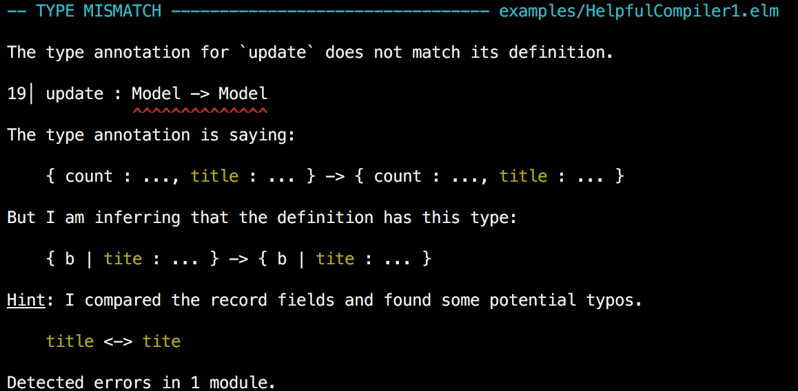
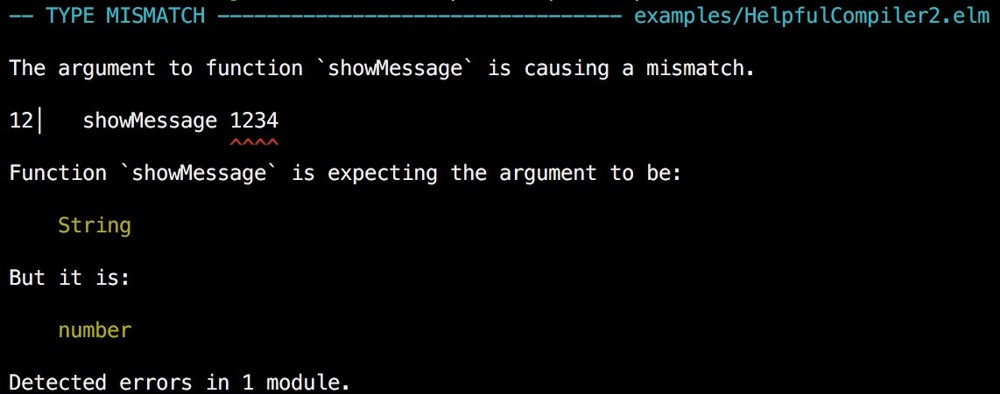
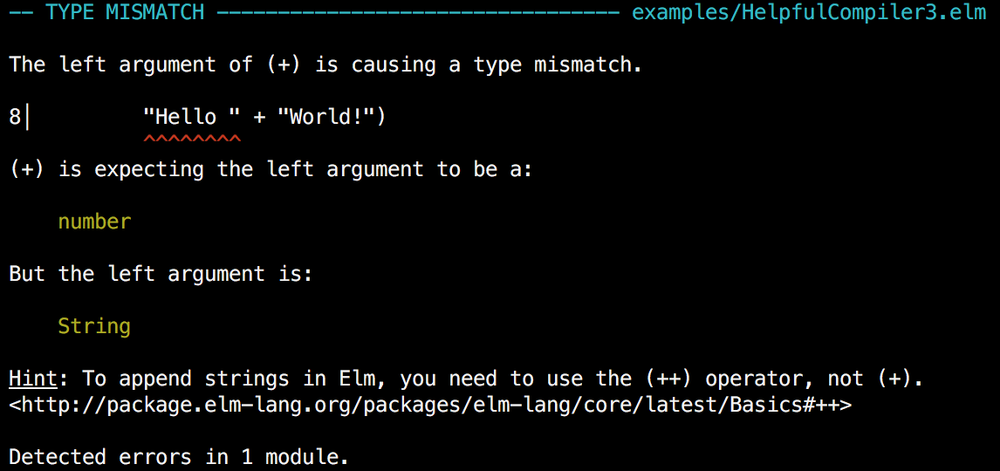
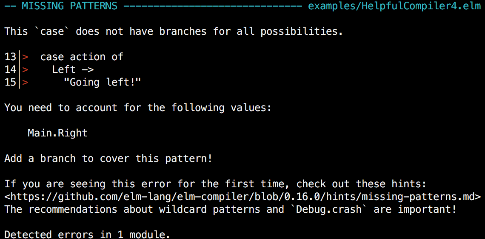
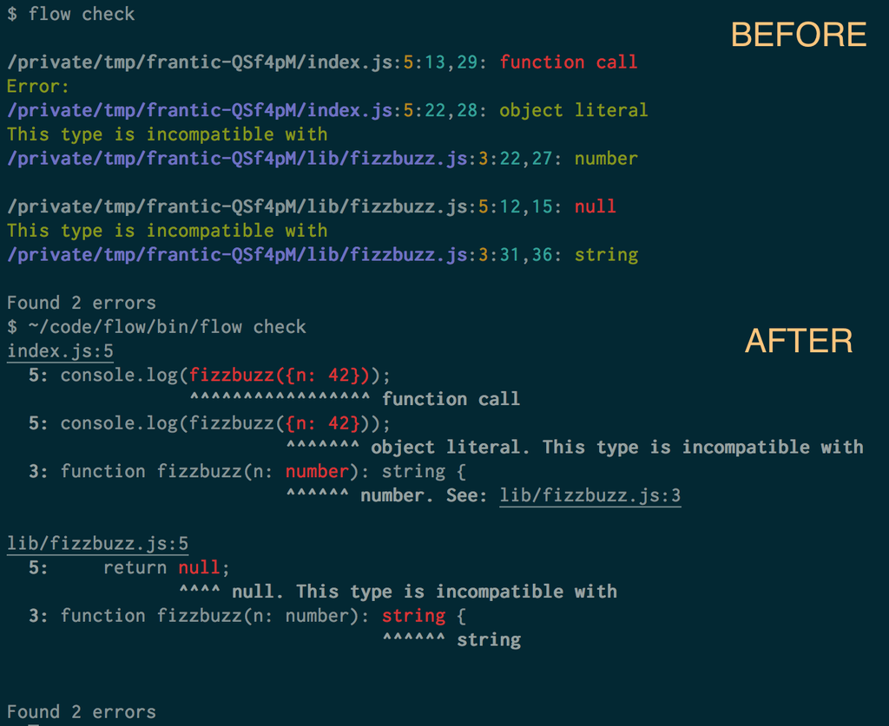

# Elm @ DublinJS

## Michael Twomey
### @micktwomey
### twoistoomany.com
### https://github.com/micktwomey/elm-dublinjs

[^1]: Hiring all the front and backend things!

---

# What is Elm?

> The best of functional programming in your browser
-- elm-lang.org

- Full programming language
- Focussed on the web front end
- Strongly Typed (in a good way)
- ML inspired (try saying Hindley–Milner three times)
- Compiles to Javascript
- Compiler is your friend (really!)

---

# A Taste of Elm

```haskell
import Graphics.Element exposing (..)

main : Element
main =
  show "Hello World"
```

---

# A Centred Taste of Elm

```haskell
import Graphics.Element exposing (..)
import Window

main : Signal Element
main =
  Signal.map view Window.dimensions

view : ( Int, Int ) -> Element
view ( width, height ) =
  container width height middle (hello)
```

---

# A Bigger Taste of Elm

```haskell
hello : Element
hello =
  Text.fromString "Hello, World!"
    |> Text.bold
    |> Text.height 72
    |> leftAligned
```

---

# Elm Philosophy


^ Trying to move JS development to a way nicer place
^ Not convinced gradual typing will get us there

---

# Some Party Tricks

- Nice Type System (really!)
- Helpful compiler error messages
- Time travelling debugger
- No runtime exceptions [^2]
- Semantic package versioning baked in

[^2]: You can call Debug.crash to get one if you want

---

## Compiler: Spot the Typo

```haskell
type alias Model = { title : String }

init : Model
init = { title = "Foo" }

update : Model -> Model
update model = { model | tite = "Bar" }

main : Element
main = show (update init)
```

---



---

## Spot the "Type"-o

```haskell
showMessage : String -> Element
showMessage message =
  show message

main : Element
main =
  showMessage 1234
```


---



---

## Learning via the Compiler

```haskell
main : Element
main =
  show ("Hello " + "World!")
```

---



---

## Hard to Express Incorrect Code

```haskell
type Action
  = Left
  | Right

act : Action -> String
act action =
  case action of
    Left -> "Goto fail, I mean, going left!"

main : Element
main =
  show (act Right)
```

---



---

## Good Ideas Spread [^3]



[^3]: https://twitter.com/alex_frantic/status/651498914252648448

---

# Time Travelling Debugger


^ Demo: http://localhost:8000/examples/Mario.elm?debug

---

# Semantic Versioning

```
$ elm package diff evancz/elm-html 3.0.0 4.0.2
Comparing evancz/elm-html 3.0.0 to 4.0.2...
This is a MAJOR change.

------ Changes to module Html.Attributes - MAJOR ------

    Removed:
        boolProperty : String -> Bool -> Attribute
        stringProperty : String -> String -> Attribute


------ Changes to module Html.Events - MINOR ------

    Added:
        type alias Options =
            { stopPropagation : Bool, preventDefault : Bool }
        defaultOptions : Html.Events.Options
        onWithOptions : String -> Html.Events.Options -> Json.Decode.Decoder a -> (a -> Signal.Message) -> Html.Attribute
```

^ Uses types to determine if package change major or a minor release
^ Won't allow you to release without revving the version correctly
^ Can diff packages

---

# Caveats

- Language still evolving, so can change with each major release [^4]
- Interop with other JS might surprise you at first

[^4]: e.g. in 0.15.1 to 0.16.0 a bunch of syntax around records was removed to simplify

---

# Integrating with Javascript

- Can embed elm app in pages
- Use ports to communicate
- Can rewrite everything in Elm [^5]
- (Tangent: "native")

[^5]: My favourite approach :smile:

^ Native Similar to C extensions in other languages
^ Some parts of Elm libraries implemented as "native" extensions

---

# Ports

```haskell
port addUser : Signal (String, UserRecord)

port requestUser : Signal String
port requestUser =
    signalOfUsersWeWantMoreInfoOn
```

^ Declare what can go in and out

--- 

```javascript
myapp.ports.addUser.send([
    "Tom",
    { age: 32, job: "lumberjack" }
]);

myapp.ports.requestUser.subscribe(databaseLookup);
function databaseLookup(user) {
    var userInfo = database.lookup(user);
    myapp.ports.addUser.send(user, userInfo);
}
```

^ Call port with correct values, incorrect types are rejected

---

# Bonus: WebGL GLSL Compiler for Free!

```haskell
vertexShader : Shader { attr | position:Vec3, color:Vec3 }
                      { unif | rotation:Mat4, perspective:Mat4, camera:Mat4 }
                      { vcolor:Vec3 }
vertexShader = [glsl|
attribute vec3 position;
attribute vec3 color;
uniform mat4 perspective;
uniform mat4 camera;
uniform mat4 rotation;
varying vec3 vcolor;
void main () {
    gl_Position = perspective * camera * rotation * vec4(position, 1.0);
    vcolor = color;
}
|]
```

---

# Lot's of Nice Stuff

- Useful, strong types and a helpful compiler (thanks ML!)
- Hard to express bad code
- Needs way less tests!
- Fun!
- Time travelling debugger
- Semantic package versioning
- Can use it today!

---

# Lot's More Stuff I Didn't Talk About

- Reactive programming (Effects, Tasks, Signals)
- Re-usable components with Elm's architecture
- Fast virtual DOM
- Nice canvas graphics
- No undefined / NULL / None !

---

# Thank you! [^6]

- Elm: http://elm-lang.org
- Elm User Group: http://www.meetup.com/Elm-User-Group-Dublin/
- Functional Kats: http://www.meetup.com/FunctionalKats/
- Slides: https://github.com/micktwomey/elm-dublinjs

[^6]: In a shock turn of events Udemy is hiring! michael.twomey@udemy.com
